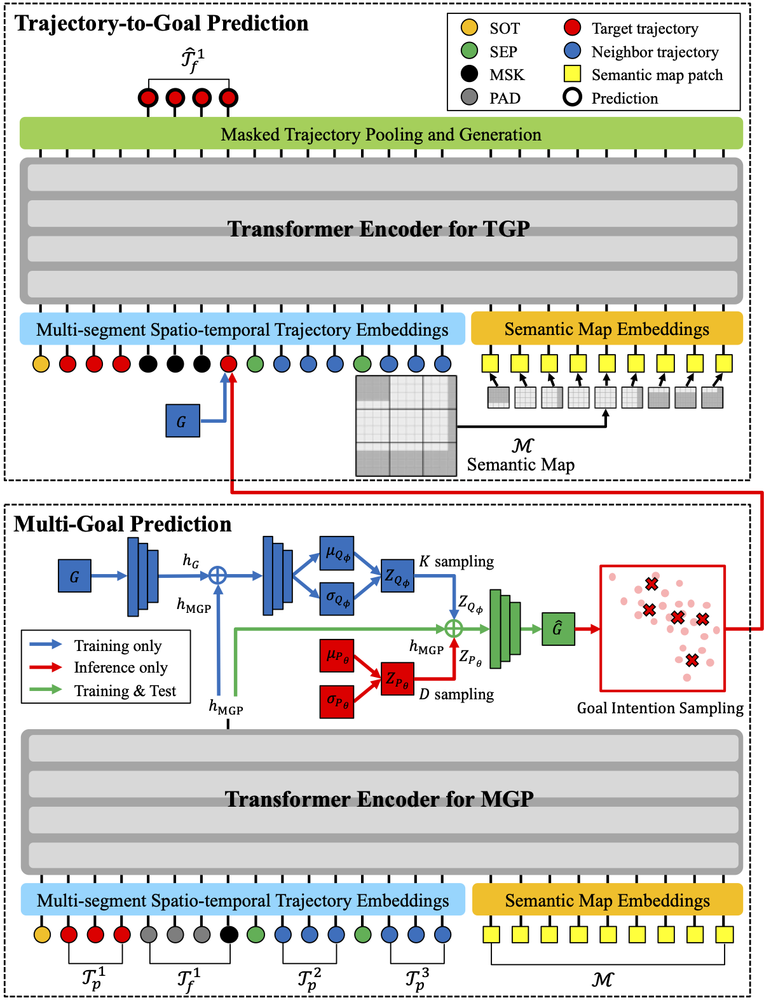

# SPU-BERT: Faster Human Multi-Trajectory Prediction from Socio-Physical Understanding of BERT.

<center></center>

## Abstract
Pedestrian trajectory prediction should be based on social and physical understanding, considering movement patterns, nearby pedestrians, and surrounding obstacles simultaneously in a complex and crowded space. Also, it is necessary to generate multiple trajectories in the same situation to realize the multi-modality of human movement. In this paper, we propose SPU-BERT, a socially and physically acceptable multi-trajectory prediction for pedestrians using two sequential BERTs for multi-goal prediction (MGP) and trajectory-to-goal prediction (TGP) with fast computation. 
MGP consists of Transformer encoder and generative models to predict multiple goals. TGP with Transformer encoder generates multiple trajectories approaching the predicted goals of MGP. 
SPU-BERT can predict socio-physically acceptable multi-trajectory by understanding movements, social interactions, and scene contexts in trajectories and semantic map. In addition, the explainable results give confidence in the socio-physical understanding of SPU-BERT.


## Requirements
The codes are developed with python 3.6.
We tested the codes in python 3.6, 3.7, and 3.8.
Additional packages are included in the `requirements.txt`.

```bash
pip install -r requirements.txt
```


### Dataset
Download datasets([data.zip](https://drive.google.com/file/d/1F80d4mEM9XXIJyaNhbBX9CSXDSDx-3Cy/view?usp=share_link)) including ETH/UCY dataset and Stanford drone dataset.
```bash
    ├── data                 # Datasets
    │    ├── ethucy          # ETH/UCY dataset
    │    └── sdd             # Stanford drone dataset
    ├── dataset              # files to load dataset: dataset.py, ethucy.py, sdd.py 
    ├── demo                 # executable files: train.py and test.py
    ├── output               # trained models
    │    ├── ethucy          # directory of the trained models for ETH/UCY datasets (eth, hotel, univ, zara1, zara2)
    │    └── sdd             # directory of the trained models for SDD (default)
    └── util
```

## Arguments

- `--cuda`, type=`bool`: The usage of GPU. 
- `--dataset_name`, type=`str`: The name of dataset among `ethucy` and `sdd`.
- `--dataset_split`, type=`str`: The split of dataset among `eth`, `hotel`, `univ`, `zara1`, and `zara2` for ETH/UCY dataset.
- `--output_name`, type=`str`: The name of output model 
- `--hidden`, type=`int`: The size of hidden state.
- `--layer`, type=`int`: The number of layers in Transformer encoders of MGP and TGP. 
- `--head`, type=`int`: The number of heads in Transformer encoders of MGP and TGP. 
- `--num_nbr`, type=`int`: The maximum number of neighbor pedestrians.
- `--view_angle`, type=`float`: The view angle to consider social interaction at the current frame.
- `--social_range`, type=`float`: The social range to consider social interaction at the current frame. 
- `--view_range`, type=`float`: The trajectory boundary range to filter out unnecessary trajectory positions.
- `--scene`, type=`bool`: The consideration of scene interaction 
- `--env_range`, type=`float`: The range of semantic map. 
- `--env_resol`, type=`float`: The resolution of semantic map.
- `--patch_size`, type=`int`: The size of patch for semantic map embedding.
- `--d_sample`, type=`int`: The number of goal intention samples.

## Training
```bash
python -m demo.train  (--cuda) --dataset_name DATASET_NAME --dataset_split DATASET_SPLIT \
                       --output_name MODEL_NAME --d_sample NUM_GIS --num_nbr NUM_NEIGHBOR --scene 
```
For ETH/UCY dataset, `DATASET_SPLIT` can be `eth`, `hotel`, `univ`, `zara1`, `zara2`.

For SDD, `DATASET_SPLIT` can be `default`. `--dataset_split` can be omitted because `default` is automatically set when `--dataset_name` is `sdd`.

The detailed description of arguments are explained in Argument below.

## Evaluation

```bash
python -m demo.test  (--cuda) --dataset_name DATASET_NAME --dataset_split DATASET_SPLIT \
                      --output_name MODEL_NAME --d_sample NUM_GIS --num_nbr NUM_NEIGHBOR --scene
```


## Pre-Trained Models
Download the pretrained model([output.zip](https://drive.google.com/file/d/1F80d4mEM9XXIJyaNhbBX9CSXDSDx-3Cy/view?usp=share_link)) 

The pretrained models are distinguished by the name of directory and the files have the same name `full_model.pth`.
If the datasets (`--dataset_name`) and splits (`--dataset_split`) are configured, the pretrained model path are automatically generated without the last directory.
Therefore, by configuring the output name (`--output_name`), the different pretrained models can be loaded and evaluated.
For example, 
```bash
--dataset_name ethucy --dataset_split eth --hidden 256 --layer 4 --head 4 --d_sample 1000  --num_nbr 4 --scene 
```
`--output_name` is set as `h256l4a4_nbr4_scnO_d1000`.
```bash
    └── output               
         ├── ethucy 
         │    ├── eth ── h256l4a4_nbr4_scnO_d1000 ── full_model.pth
         │    ├── hotel
         │    ├── univ
         │    ├── zara1
         │    └── zara2
         └── sdd   
              └── default          
    
```  
We provide various pretrained models with different settings as below.
- `h256l4a4_nbr4_scnO_d1000`: `--hidden 256 --layer 4 --head 4 --d_sample 1000  --num_nbr 4 --scene`
- `h256l4a8_nbr4_scnO_d1000`: `--hidden 256 --layer 4 --head 4 --d_sample 1000  --num_nbr 4 --scene`
- `h256l4a4_nbr4_scnO_d1000`: `--hidden 256 --layer 4 --head 4 --d_sample 1000  --num_nbr 4 --scene`
- `h256l4a4_nbr4_scnO_d1000`: `--hidden 256 --layer 4 --head 4 --d_sample 1000  --num_nbr 4 --scene`
- `h256l4a4_nbr4_scnO_d1000`: `--hidden 256 --layer 4 --head 4 --d_sample 1000  --num_nbr 4 --scene`
- `h256l4a4_nbr4_scnO_d1000`: `--hidden 256 --layer 4 --head 4 --d_sample 1000  --num_nbr 4 --scene`
- `h256l4a4_nbr4_scnO_d1000`: `--hidden 256 --layer 4 --head 4 --d_sample 1000  --num_nbr 4 --scene`
- `h256l4a4_nbr4_scnO_d1000`: `--hidden 256 --layer 4 --head 4 --d_sample 1000  --num_nbr 4 --scene`
- `h256l4a4_nbr4_scnO_d1000`: `--hidden 256 --layer 4 --head 4 --d_sample 1000  --num_nbr 4 --scene`
- `h256l4a4_nbr4_scnO_d1000`: `--hidden 256 --layer 4 --head 4 --d_sample 1000  --num_nbr 4 --scene`


## Thanks

Transformers used in this model comes from [HugginFace](https://huggingface.co/).

ETH/UCY Dataset and SDD come from [Y-Net](https://github.com/HarshayuGirase/Human-Path-Prediction).  


## Citation  
If you find this work useful, it would be grateful to cite our paper!

```bib
@article{na2022knowledge,
  title={SPU-BERT: Faster Human Multi-Trajectory Prediction from Socio-Physical Understanding of BERT},
  author={Ki-In Na, Ue-Hwan Kim, and Jong-Hwan Kim},
  journal={Knowledge Based Systems (submitted)},
  year={2022}
}
```

## Contact us

Ki-In Na ([@kina4147](https://github.com/kina4147)): kina4147@gmail.com  
